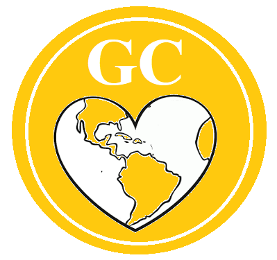

# Conoce GarbageCollector Game
**Visita la versión actual del Aplicativo,** [GarbageCollector Game (Próximamente)](https://github.com/steelheart93/GarbageCollector-Game)

## Diagrama de Casos de Uso

## GC Coin, Boceto

* * *

## GarbageCollector Game como proyecto de Investigación
Visita la biblioteca de referencias utilizadas en Mendeley, [Mendeley Library](https://www.mendeley.com/library/community/grupo-11-8)

## Carpetas Compartidas del Grupo
* [Grupo 11 - Investigación para Ingeniería](https://drive.google.com/drive/u/1/folders/1m0EG9M_oexe-XutzTsV5faYpL3UPuNXg)
* [Talleres Investigación](https://drive.google.com/drive/u/1/folders/1b9rF30birvm4rA6tsZtkW5r8BbzoOmZV)

## Presentaciones Formación Inicial Innóvate CHEC
* [Design Thinking](/Formación Inicial/Design Thinking.pdf)
* [Lean Startup](/Formación Inicial/Lean Startup.pdf)
* [Prototipado](/Formación Inicial/Prototipado.pdf)
* [Vigilancia Estratégica](/Formación Inicial/Vigilancia Estratégica.pdf)

## Agradecimientos 
* **Juan Sebastian Agudelo Martinez** - Miembro del Grupo de Investigación  de la U. de Caldas.
* **Andres Felipe Gomez Pulgarin** - Miembro del Grupo de Investigación  de la U. de Caldas.
* **Maria Amparo Murillo Jimenez** - Asesora Comercial del Proyecto.
* **Julian Andres Castellanos Hernandez** - Asesor de Ingeniería Industrial del Proyecto.
* **Alejandro** - Integrante de Cubo R3.
* **Equipo Innóvate CHEC** - CHEC Grupo EPM, Fundación EPM, Parque Explora Medellín, Neurocity, Cámara de Comercio de Manizales por Caldas y Equipo Tecnoparque SENA nodo Manizales.

#### Contacto
**Stiven Muñoz Murillo** - Líder de Proyecto, [stivenmm1993@gmail.com](mailto:stivenmm1993@gmail.com)
